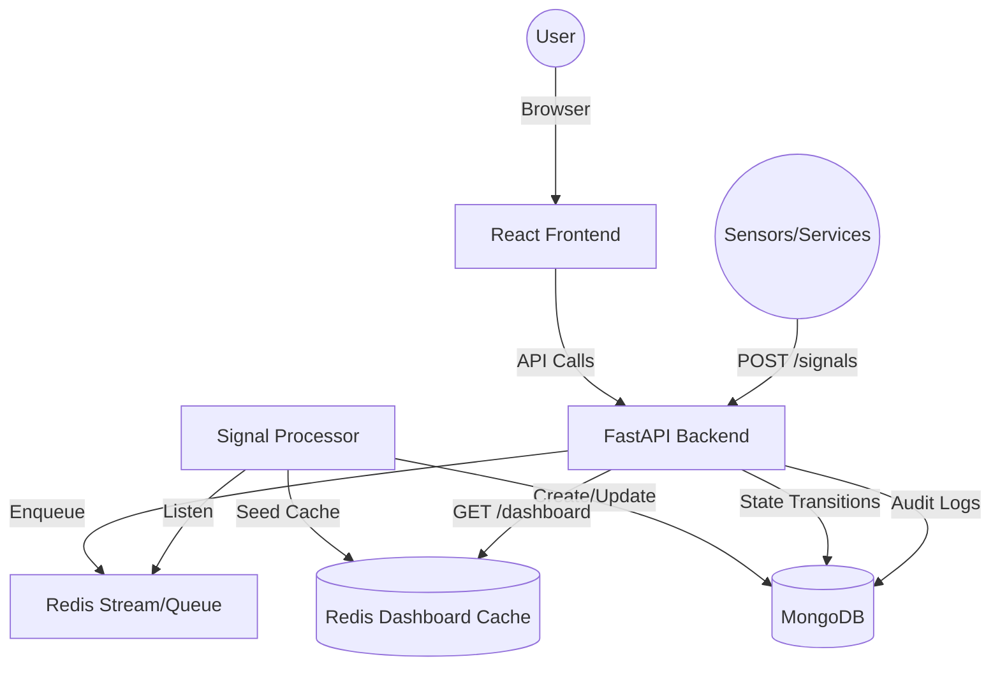

# Incident Hub 🚨

A production-ready Incident Management System (IMS) designed for high-throughput signal ingestion, automated lifecycle management, and zero-latency monitoring.

## 🏗️ Architecture



## 🚀 Getting Started

### Prerequisites
- Docker & Docker Compose
- Node.js (for local frontend development)
- Python 3.11+ (for local backend development)

### One-Command Setup
```bash
docker-compose up --build -d
```
The system will be available at:
- **Frontend**: [http://localhost:5173](http://localhost:5173)
- **Backend API**: [http://localhost:8000](http://localhost:8000)
- **API Docs**: [http://localhost:8000/docs](http://localhost:8000/docs)

### Seed Sample Data
```bash
python scripts/seed_data.py
```

## 🛡️ Production Features

### 1. High-Throughput Signal Ingestion
The `/signals` endpoint is designed for extreme load. Instead of writing directly to the database, signals are offloaded to a Redis queue. A dedicated background worker processes these signals asynchronously, ensuring the ingestion API remains responsive under pressure.

### 2. State Machine Lifecycle
Incidents follow a strict, sequential state pattern:
`OPEN → INVESTIGATING → RESOLVED → CLOSED`
- Atomic transitions using MongoDB `find_one_and_update` with state filters.
- Mandatory **Root Cause Analysis (RCA)** before closing an incident.

### 3. Performance-Optimized Dashboard
The dashboard (`/dashboard`) leverage a Redis Hash-based cache. 
- **Zero-DB Latency**: Reads bypass MongoDB entirely.
- **Warming logic**: Automatically rebuilds the cache from MongoDB on cold-starts.
- **Instant Sync**: Cache is updated in real-time by the worker and API mutation endpoints.

### 4. Backpressure & Resilience
- **Rate Limiting**: Redis-backed rate limiter on the ingestion API (1000 req/sec).
- **Debouncing**: Automated 10-second window to prevent duplicate incidents for the same component.
- **Retry Logic**: All database operations are wrapped in exponential backoff retry decorators.
- **Health Monitoring**: `/health` endpoint for automated dependency checks (DB + Redis).

## 🛠️ Tech Stack
- **Backend**: FastAPI, Motor (Async MongoDB), Redis-py, Pydantic.
- **Frontend**: React 19, Vite, Tailwind CSS 4, Framer Motion, Lucide React.
- **Infrastructure**: Docker, MongoDB, Redis.
